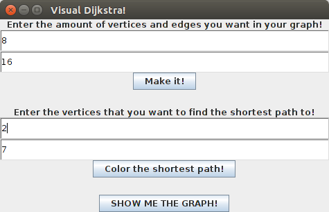
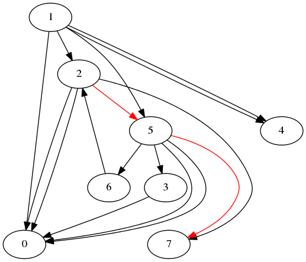

# VisualDijkstra
================
VisualDijkstra is a GUI program that allows you create 
random graphs with your specified amount of vertices 
and edges, highlight the shortest path from your specified 
vertices, and display the graph using 
<a href = "http://www.graphviz.org/"> Graphviz </a>. 

Below are images of what the GUI looks like, as well as what the 
graph looks like after highlighting the shortest path.

